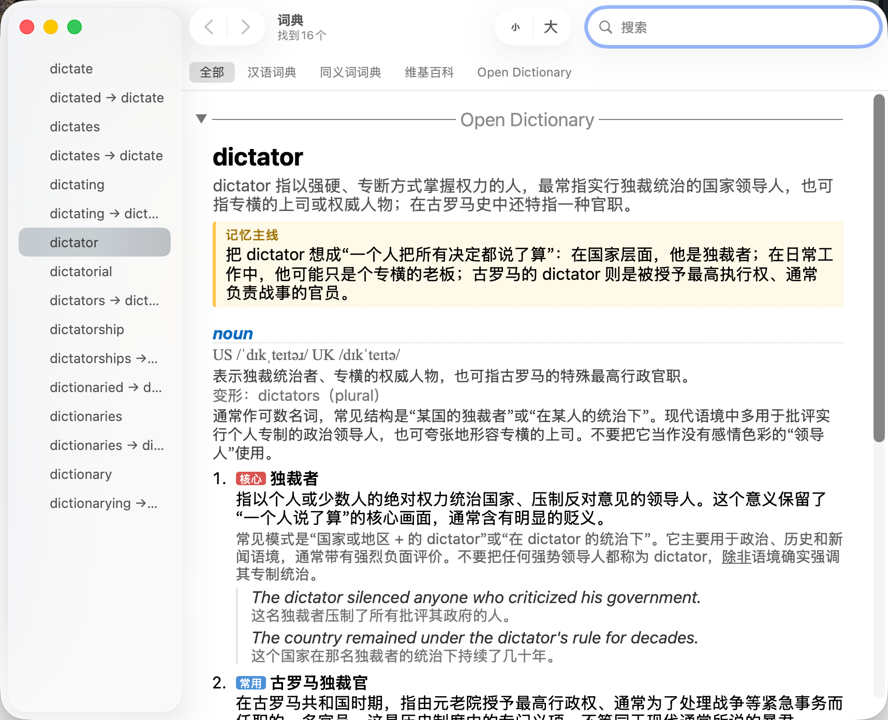

# Open Dictionary for Dictionary.app

把 [ahpxex/open-dictionary](https://github.com/ahpxex/open-dictionary) 的
84,212 条英汉学习词条装进 macOS 自带的「词典.app」，Spotlight、三指查词、
右键「查询」全都能用。



## 安装

两个版本，同一本词典，二选一：

```bash
brew tap wesleyel/dict https://github.com/wesleyel/opendict-apple
brew install --cask open-dictionary         # ~90 MB，不含发音
brew install --cask open-dictionary-audio   # 打包英美发音，离线可用
```

装完在 **词典.app → 设置** 里勾选 *Open Dictionary* 启用。

不用 Homebrew 就到 [Releases](https://github.com/wesleyel/opendict-apple/releases)
下 zip，解压后把 `Open Dictionary.dictionary` 拖进 `~/Library/Dictionaries/`。

## 发音

发音版在词头旁边加 🔊英／🔊美 按钮，音频**打包在词典内**，不联网。

这不是为了省事：词典.app 的词条视图没有出网权限，远程音频一律报
`MEDIA_ERR_SRC_NOT_SUPPORTED`，在线发音接口做不了。代价是体积约 1.4 GB，
所以拆成两个版本发布。约三成词条（多词短语、连字符复合词）本身没有录音，
这些词不显示按钮。

按钮依赖 JavaScript：词典.app 里可用，**三指取词的弹窗不支持 JS**，弹窗里没有声音。

## 自己构建

```bash
make fetch     # 下载上游数据（~97 MB）
make install   # 转换 → 编译 → 装进 ~/Library/Dictionaries
```

先小样试跑：`make dict LIMIT=500`。冒烟测试：`make test`。

发音版（抓取耗时数小时、可断点续传）：

```bash
make audio         # 抓取全部发音，落在 audio_files/
make install-audio # 带发音转换 → 编译 → 安装
```

## 文档

| doc | description |
|---|---|
| [docs/build.md](docs/build.md) | 构建流程、依赖、参数、排错 |
| [docs/ci.md](docs/ci.md) | GitHub Actions 与发版 |
| [docs/format.md](docs/format.md) | 数据契约到 Apple 词典格式的映射 |

## 许可

转换工具 MIT（[LICENSE](LICENSE)）。**词典数据 CC BY-SA 4.0**，源自 Wiktionary，
再分发须保留署名并以相同许可发布 —— 见 [LICENSE-DATA.md](LICENSE-DATA.md)。
